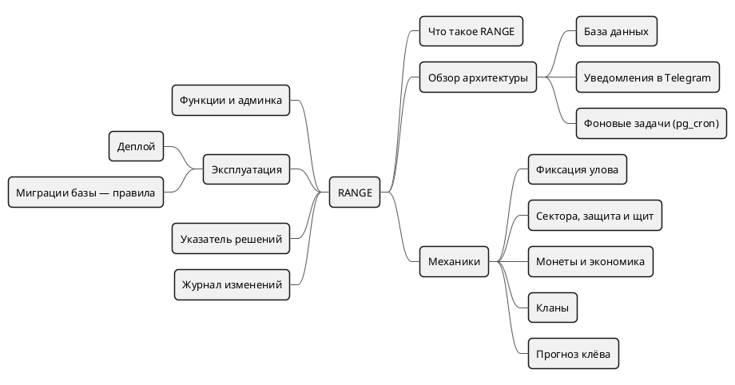
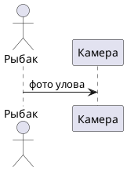

---
tags:
  - указатель
aliases:
  - "Главная"
  - "Home"
  - "DOCS"
updated: 2026-10-07
---
# RANGE — документация

Рыболовная игра-карта для Батуми и Москвы: улов захватывает сектор воды, сектора держат кланами, за всё — монеты (catchrange.com, бот @catchrangebot). Здесь — как продукт устроен и почему он устроен именно так.



Связанные заметки: [[Что такое RANGE]] · [[Обзор архитектуры]] · [[База данных]] · [[Уведомления в Telegram]] · [[Фоновые задачи (pg_cron)]] · [[Фиксация улова]] · [[Сектора, защита и щит]] · [[Монеты и экономика]] · [[Кланы]] · [[Прогноз клёва]] · [[Деплой]] · [[Миграции базы — правила]] · [[Указатель решений]] · [[Журнал изменений]]

## С чего начать
- [[Что такое RANGE]] — продукт и история названия.
- [[Обзор архитектуры]] — из чего состоит сервис, схема.
- [[Фиксация улова]] — главный путь игрока от фото до уведомления.
- [[Сектора, защита и щит]] · [[Монеты и экономика]] · [[Кланы]] · [[Прогноз клёва]] — механики со схемами.

## Разделы
| Папка | Что внутри |
|---|---|
| `10 Продукт` | что это и для кого |
| `20 Архитектура` | код, база, авторизация, карта, Telegram, расписание, API |
| `30 Механики` | улов, сектора, монеты, кланы, битва, прогноз |
| `40 Функции` | профиль, подписки, лента, комментарии, приглашения, игра [[Где это]] |
| `45 Администрирование` | права, жалобы, блокировки, правки уловов |
| `50 Эксплуатация` | деплой, бэкапы, миграции, разработка, генератор сетки |
| `60 Решения` | журнал решений (ADR) — [[Указатель решений]] |
| `70 Журнал` | [[Журнал изменений]] |
| `80 Архив` | однофайловый прототип |
| `Шаблоны` | заготовки новых заметок |

Правила для игроков (цены, награды, лимиты) живут в приложении — `web/lib/data/faq.ts`, раздел «Вопросы и ответы». Числа в заметках сверены с ним, с кодом и с базой на дату в поле `updated`.

## Как вести документацию
- **Одна тема — одна заметка.** Название = о чём заметка; связи — ссылками `[[…]]`, а не «см. ниже».
- **Свойства вверху заметки:** `tags` (раздел), `aliases` (другие названия — для поиска), `source` (откуда перенесено), `updated` (дата сверки).
- **Меняется код — меняется заметка** в том же заходе: правила, цены, расписание, схемы. Значимое изменение — строка в [[Журнал изменений]]; принципиальный выбор — новое решение из [[Шаблон — решение (ADR)]].
- **Секреты не записывать:** токены, пароли, ключи, `CRON_SECRET`.

## Схемы PlantUML
Схемы рисует community-плагин **PlantUML** (Johannes Theiner, `obsidian-plantuml`). Синтаксис плагина — блок кода с языком `plantuml-svg`:

````markdown


Связанные заметки: [[Фиксация улова]]
````

- `plantuml-svg` — чёткая векторная картинка, используем везде; `plantuml` — PNG; `plantuml-ascii` — текстом, только для диаграмм последовательности.
- **Ссылки на заметки — строкой под схемой** («Связанные заметки: …»). Свой синтаксис ссылок плагина `[[[Заметка]]]` внутри схемы в режиме SVG передаёт в PlantUML только первое слово названия: у заметок из нескольких слов ссылка ломается, а клик создаёт пустую заметку. Внутри схемы его можно ставить только для заметок с названием из одного слова (например `[[[Кланы]]]`, `[[[Деплой]]]`).
- Отдельный файл `.puml` тоже открывается плагином; `!include` работает только при локальном рендере (нужна Java).
- Рендер идёт через сервер plantuml.com (настройка плагина «Server URL»): текст схемы уходит на сервер. Для полностью локального рендера — Java + `plantuml.jar` в настройках плагина.
- Новая схема перед сохранением проверяется на сервере PlantUML: ошибка синтаксиса видна прямо в заметке вместо картинки.
