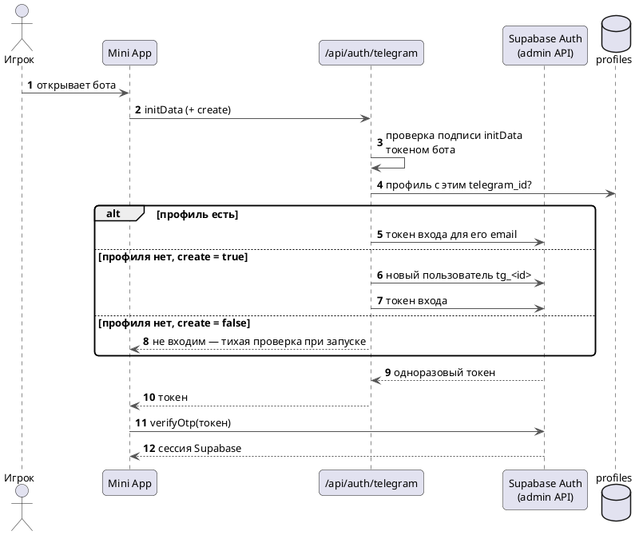

---
tags:
  - архитектура
  - схема
aliases:
  - "Вход"
  - "Аккаунты"
source: "DOCS.md § «Авторизация»"
updated: 2026-10-07
---
# Авторизация

Supabase Auth, email+пароль (см. [[Указатель решений|DECISIONS.md]] почему не magic link/OAuth в v1). Формы входа/регистрации отдельного роута `/auth` больше нет — `AuthForm.tsx` встроена прямо в `screen-profile` (см. [[Указатель решений|DECISIONS.md]], «форма входа встроена в профиль»). Почта подтверждается: регистрация, восстановление пароля и привязка почты к Telegram-аккаунту идут через 6-значный код из письма (`OtpCodeStep.tsx`). Повторная отправка кода доступна через 60 секунд: чаще Supabase одному адресу не пишет. Письма уходят через свой SMTP. Это видно по данным: 30.09 за один час ушло 20 писем с кодами, а встроенная почта Supabase отправляет 2 письма в час и только адресам команды проекта. Часовой лимит писем — Supabase Dashboard → Authentication → Rate Limits (для своего SMTP по умолчанию 30 в час).

`components/providers/AuthProvider.tsx` держит текущую сессию (`supabase.auth.onAuthStateChange`) в React-контексте, используется всем app-shell'ом. **Важно**: `lib/supabase/client.ts` — синглтон (`createClient()` возвращает один и тот же экземпляр на вкладку). Отдельный `createBrowserClient()` на каждый вызов — частая ошибка: `onAuthStateChange` срабатывает только на том экземпляре, который выполнил вход/выход, поэтому форма логина и `AuthProvider` с разными инстансами друг друга не видят без полной перезагрузки страницы. Наступили на эти грабли и в этой сессии — см. запись в [[Журнал изменений|CHANGELOG.md]].

Карта/территории/активность/профиль доступны без входа (просмотр). Попытка нажать «+» без сессии переключает на вкладку «Профиль» (не молча ничего не делает) — а там без сессии сразу форма входа/регистрации, а не пустая заглушка.

## Вход через Telegram Mini App

Supabase не умеет «войти через Telegram», поэтому сервер проверяет подпись `initData` токеном бота и выпускает одноразовый токен входа через admin API (`/api/auth/telegram`). Email-аккаунт может привязать Telegram: из профиля (`/api/telegram/link-token` → бот `/start link_…`) или внутри Mini App (`/api/auth/telegram/link`).

Связанные заметки: [[API-маршруты]]

## См. также
- [[API-маршруты]]
- [[Уведомления в Telegram]]
