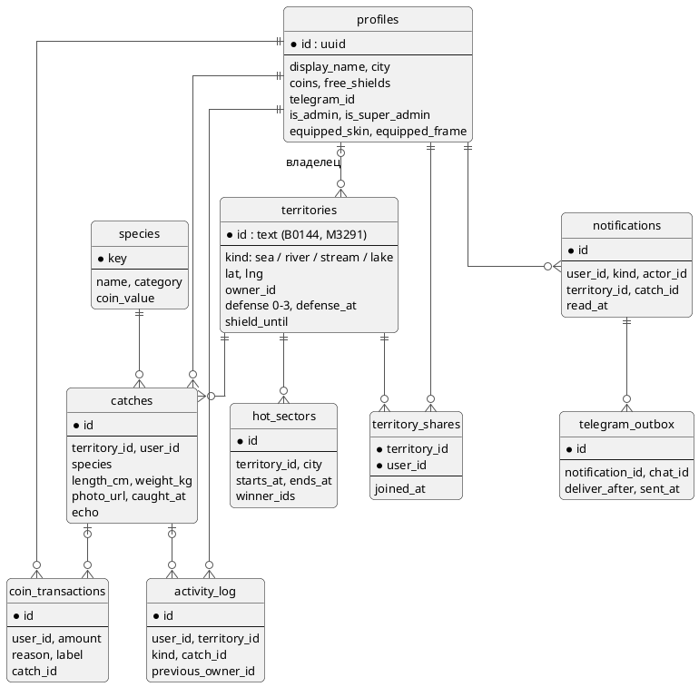

---
tags:
  - архитектура
  - схема
aliases:
  - "Supabase"
  - "Postgres"
  - "Таблицы"
source: "DOCS.md § «База данных (Supabase Postgres)»"
updated: 2026-10-07
---
# База данных

Главные таблицы и связи — на схеме; ниже исходное описание. Полный список таблиц (60+) — `list_tables` / `web/lib/types.ts` (генерируется). Кланы — отдельная схема в [[Кланы]].

Проект `yhgdcdkfkerzuhnzjzrz` («Project 1», см. `mcp__…__list_projects`). Схема применена через Supabase MCP (`apply_migration`), не через файлы в репозитории — если нужно посмотреть точный DDL, он в истории миграций проекта в Supabase, а актуальная схема получается через `list_tables`/`generate_typescript_types`.

Таблицы:
- **`profiles`** — `id` (=`auth.users.id`), `display_name`, `location`, `avatar_url` (nullable), `bio` (nullable), `is_admin` (`boolean not null default false`, см. «Админ: `profiles.is_admin`» ниже), `is_super_admin` (`boolean not null default false`, см. «Супер-админ» ниже), `is_blocked` (`boolean not null default false`, см. «Блокировка пользователя» ниже), `public_id` (`text not null unique`, 5 цифр, см. «Публичный ID пользователя» ниже). Создаётся автоматически триггером `handle_new_user()` при регистрации.
- **`admin_actions`** — журнал действий админов: `admin_id` (FK `profiles`, `on delete cascade`), `action` (`grant_admin`/`revoke_admin`/`delete_catch`/`dismiss_report`/`block_user`/`unblock_user`), `target_user_id`/`territory_id` (nullable, контекст действия), `details` (готовый человекочитаемый текст, собранный внутри RPC в момент действия — не пересобирается при чтении), `created_at`. `select` — только `is_super_admin`. См. «Супер-админ» ниже. Читать/писать `followers_count`/`following_count` напрямую нельзя — это не колонки, см. `profiles_with_stats` ниже.
- **`follows`** — подписки: `follower_id`, `followee_id` (оба FK на `profiles`, составной PK, `check (follower_id <> followee_id)`). Публично читаема; `insert`/`delete` — только своя строка (`auth.uid() = follower_id`), без RPC (простая одно-табличная операция, RPC тут не нужен, в отличие от `confirm_catch`).
- **`catch_reports`** — жалобы на фото: `catch_id` (FK `catches`, `on delete cascade`), `reporter_id` (FK `profiles`, `on delete cascade`), `reason` (text, один из `REPORT_REASONS`, не enum), `created_at`. `insert` — любой `authenticated` на свою `reporter_id`; `select` — только `is_admin`-профили. См. «Жалобы на фото и модерация» ниже.
- **`territories`** — «тонкая» таблица только для владения: `id` (текст вида `"B0144"`, совпадает с `public/data/sectors.json`), `kind`, `lat`, `lng`, `owner_id` (nullable FK на `profiles`), `claimed_at`. Строка есть у каждого сектора из `sectors.json`, и `kind` отсюда — источник правды для типа водоёма: клиент и серверные челленджи/достижения берут его из БД, супер-админ меняет его на экране сектора (`admin_set_territory_kind`), `kind` из файла — только запасной вариант. Геометрия (`corners`) сюда намеренно не входит — она статична и живёт в `public/data/sectors.json` (см. [[Указатель решений|DECISIONS.md]], почему не денормализовали в БД).
- **`species`** — справочник видов рыб: `key` (текстовый slug, PK), `name`, `category` (`'marine'`|`'freshwater'`). 36 записей (23 морских + 13 пресноводных, список — в [[Указатель решений|DECISIONS.md]]), читается публично, пишется только вручную через миграции (не UI). Таблица, а не хардкод в TS — в отличие от `METHODS`/`BAITS` (маленькие фиксированные списки), 36+ видов с категорией — уже полноценный справочник, который может расти без передеплоя.
- **`catches`** — один улов: `territory_id`, `user_id`, `species` (текст, FK на `species.key`), `length_cm`/`weight_kg`/`method`/`bait` (все **nullable** — обязателен только вид рыбы, остальное по желанию рыбака, см. [[Указатель решений|DECISIONS.md]]), `photo_url` (**text, NOT NULL** — без загруженного фото улов не создаётся вообще, см. [[Указатель решений|DECISIONS.md]]), `caught_at`.
- **`activity_log`** — лента активности: `user_id`, `territory_id`, `kind` (`'catch'`|`'claim'`), `catch_id`, `previous_owner_id` (nullable FK на `profiles`, заполняется только у `'claim'`-строк — кто владел территорией до захвата, см. «Персонализированная лента активности» ниже). Пишется атомарно вместе с уловом внутри RPC (не отдельным клиентским запросом).
- **`territories_with_stats`** (view, `security_invoker`) — `territories` + `catch_count`/`last_catch_at`, агрегированные из `catches`. Не денормализовано в саму таблицу — 658 территорий, агрегация дешёвая, лишний триггер/риск рассинхронизации не нужен.
- **`profiles_with_stats`** (view, `security_invoker`) — `profiles` + реальные `followers_count`/`following_count` (агрегация из `follows`, тот же паттерн, что `territories_with_stats`). Заменила прежнюю статичную колонку-заглушку `profiles.followers_count` (она удалена). Все чтения профиля (`useProfile`) идут через эту view, не через `profiles` напрямую; запись (`useUpdateProfile`) — по-прежнему в `profiles` (обновлять вью нельзя).

RLS: все таблицы читаются публично (`select using (true)`) — карта, список территорий, лента активности, справочник видов и подписки видны без входа (см. решение «Карта публична» в [[Указатель решений|DECISIONS.md]]). Прямых `insert`/`update` политик для клиентов нет, кроме `follows` (своя строка) и `profiles` (своя строка, `update using (auth.uid() = id)` — уже была на момент создания таблицы, использована для редактирования имени/аватара без новых миграций RLS). Вся остальная запись — через RPC.

RPC `admin_delete_catch(p_catch_id)`/`admin_dismiss_report(p_report_id)`/`admin_set_blocked(p_user_id, p_blocked)` — все `SECURITY DEFINER`, доступны роли `authenticated` (явный `revoke ... from anon`, та же необходимость, что была у `confirm_catch`/`handle_new_user` — Supabase по умолчанию даёт `anon` выполнять новые функции), но сами проверяют `is_admin` внутри и бросают исключение, если вызвавший не админ — грант на `authenticated` тут не является границей авторизации, ей является проверка внутри тела функции. `confirm_catch` дополнительно проверяет `is_blocked` вызывающего. См. «Жалобы на фото и модерация» и «Блокировка пользователя» ниже.

RPC `confirm_catch(p_territory_id, p_species, p_photo_url, p_length_cm default null, p_weight_kg default null, p_method default null, p_bait default null)` — `SECURITY DEFINER`, доступна только роли `authenticated`. `p_photo_url` — обязательный параметр (не `default null`), стоит перед необязательными (Postgres требует параметры с дефолтом последними). Атомарно (с `select … for update` на строке территории, чтобы не ловить гонку при одновременном захвате): вставляет улов → переводит `owner_id` территории на текущего пользователя (последний улов побеждает — так же, как в прототипе) → пишет `activity_log` (запись `'catch'`, и `'claim'` дополнительно с `previous_owner_id` = прежним владельцем, если территория поменяла владельца). Клиент вызывает её через `supabase.rpc('confirm_catch', {...})` в `lib/supabase/queries.ts` (`useConfirmCatch`), передавая `null` вместо `undefined` для необязательных полей (сгенерированные типы RPC хотят `undefined` — конвертация через `?? undefined` на вызове, см. код).

**Storage**: два публичных на чтение бакета. `catch-photos` — `insert` только `authenticated`, только в свою папку (`(storage.foldername(name))[1] = auth.uid()::text`), путь `{userId}/{timestamp}.jpg`, см. `lib/supabase/storage.ts` (`uploadCatchPhoto`). `avatars` — тот же паттерн политик и путей, `uploadAvatar`. Оба бакета не поддерживают `update`/`delete` объектов с клиента — новый аватар/фото всегда грузится под новым именем файла (`Date.now()`), старый файл остаётся сиротой в бакете (безвредно, см. [[Журнал изменений|CHANGELOG.md]]).

## См. также
- [[Миграции базы — правила]]
- [[Фоновые задачи (pg_cron)]]
- [[Фиксация улова]]
