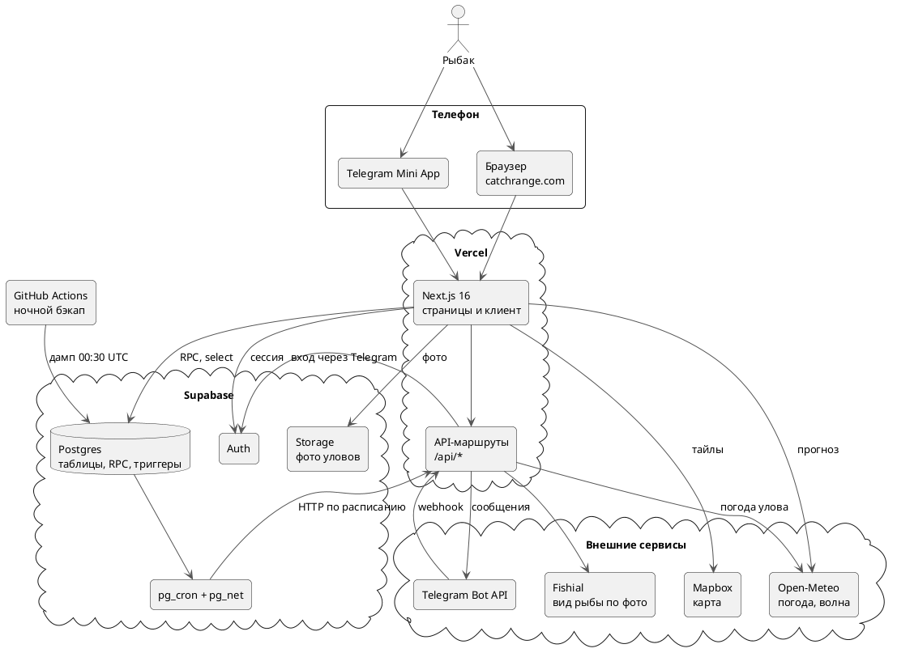

---
tags:
  - архитектура
  - схема
aliases:
  - "Архитектура"
  - "Как устроен сервис"
source: "DOCS.md § «Веб-сервис (web/)»"
updated: 2026-10-07
---
# Обзор архитектуры

Next.js (App Router, TypeScript) + Supabase (Postgres, Auth) + Vercel (деплой). Дизайн и экраны перенесены из `fishzone-app.html` почти один-в-один (см. [[Указатель решений|DECISIONS.md]]) — те же 7 экранов, те же CSS-токены/классы, та же логика достижений/статистики. Отличие — не выдумка/редизайн, а следствие смены платформы: настоящие аккаунты вместо одного демо-юзера, данные в Postgres вместо памяти браузера, публичная карта без входа (Strava-style), убрана декоративная рамка телефона/статус-бар (незачем рисовать второй поверх настоящего в реальном браузере на телефоне).

## Из чего состоит сервис

- **Клиент** — Next.js-приложение в браузере или в Telegram Mini App ([[Структура кода]]).
- **Vercel** — хостинг страниц и серверных маршрутов `/api/*` ([[API-маршруты]], [[Деплой]]).
- **Supabase** — Postgres с RPC и триггерами, Auth, Storage для фото, `pg_cron` + `pg_net` для фоновых задач ([[База данных]], [[Фоновые задачи (pg_cron)]]).
- **Внешние сервисы** — Telegram Bot API ([[Уведомления в Telegram]]), Mapbox ([[Карта]]), Open-Meteo ([[Прогноз клёва]]), Fishial (распознавание вида по фото).
- **GitHub Actions** — ночная зашифрованная копия базы ([[Резервные копии базы]]).

Элементы схемы кликабельны — ведут в заметки.

Связанные заметки: [[Структура кода]] · [[API-маршруты]] · [[База данных]] · [[Авторизация]] · [[Фоновые задачи (pg_cron)]] · [[Уведомления в Telegram]] · [[Карта]] · [[Прогноз клёва]] · [[Резервные копии базы]]
