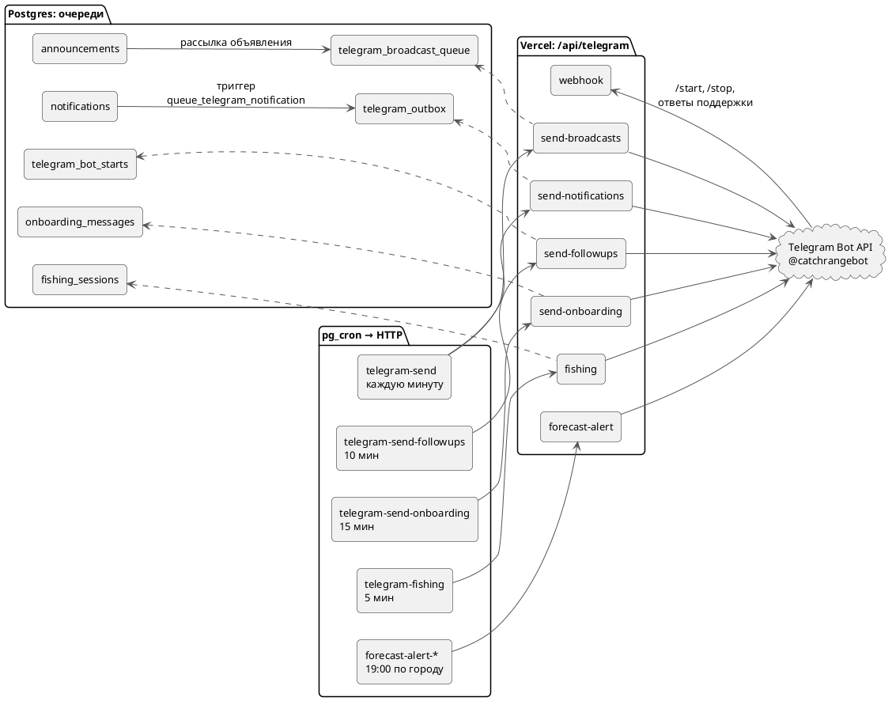

---
tags:
  - архитектура
  - telegram
  - схема
aliases:
  - "Telegram-бот"
  - "Очереди Telegram"
source: "DOCS.md § «Отправка уведомлений в Telegram»"
updated: 2026-10-07
---
# Уведомления в Telegram

Бот **@catchrangebot**. Всё, что уходит в Telegram, сначала пишется в очередь в Postgres; `pg_cron` по расписанию дёргает маршруты `/api/telegram/*` на Vercel, они отправляют и отмечают строки. Входящие сообщения (`/start`, `/stop`, ответы поддержки) приходят в `webhook`.

- Очереди `telegram_outbox` (уведомления) и `telegram_broadcast_queue` (рассылка объявлений) разбирают маршруты Vercel `app/api/telegram/send-notifications` и `send-broadcasts`.
- Их зовёт одна задача pg_cron `telegram-send` раз в минуту, и каждый маршрут только если в его очереди есть что отправлять (`where exists (…)` с теми же условиями, что в маршруте). Пустые минуты не тратят ни запросов к Supabase, ни вызовов Vercel.
- Прежние задачи `telegram-send-notifications` и `telegram-send-broadcasts` выключены (`active = false`), но не удалены. Откат: `select cron.unschedule('telegram-send')` и включить их обратно через `cron.alter_job(…, active := true)`. `telegram-send-followups` (раз в 10 минут) работает как раньше.
- В командах задач лежит секретный заголовок `CRON_SECRET`. Целиком их не выводить: при просмотре маскировать `Bearer …`.
- **Включены по умолчанию.** Бот может писать только тем, кто нажимал /start. Им уведомления включаются сами, если игрок ни разу не выбирал: триггер `profiles_tg_default_on` срабатывает, когда к аккаунту привязывается Telegram с /start, а `telegram_bot_starts_default_on` — когда привязанный игрок впервые нажимает /start. Время включения пишется в `profiles.tg_auto_enabled_at`.
- **Выбор игрока главнее.** Переключатель в профиле (`set_telegram_notifications`), команда `/stop` в боте и «Подключить уведомления» из профиля пишут `tg_choice_at`. После этого уведомления сами больше не включаются, в том числе при новой привязке Telegram. Заблокировавшим бота (`tg_unreachable_at`) не включаются никогда.
- **Первое сообщение объясняет.** Включённому по умолчанию первое уведомление приходит с припиской «Выключить — команда /stop или «Уведомления в Telegram» в профиле» (`send-notifications`), после чего ставится `tg_auto_notice_at`.
- **Улов друга — одно сообщение на серию.** `queue_telegram_notification` не ставит в очередь `follow_catch`, если от того же рыбака тому же игроку уже было такое уведомление за последние 3 часа (тот же разрыв, что у серий в ленте). В «Активности» каждый улов по-прежнему отдельно.
- `/stop` выключает только уведомления из игры. Объявления супер-админа (`admin_post_announcement`) уходят всем, кто нажимал /start.

## См. также
- [[Фоновые задачи (pg_cron)]]
- [[API-маршруты]]
- [[Авторизация]]
