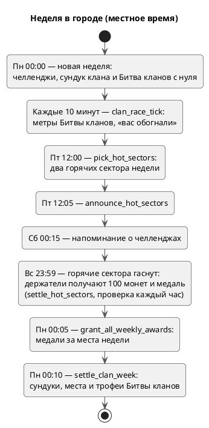

---
tags:
  - архитектура
  - эксплуатация
  - схема
aliases:
  - "pg_cron"
  - "Расписание"
  - "Cron"
updated: 2026-10-07
---
# Фоновые задачи (pg_cron)

Все регулярные задачи живут в Supabase: `pg_cron` запускает SQL-функции, а для работы с Telegram и погодой — HTTP-запросы через `pg_net` к маршрутам `/api/*` (Vercel Cron на тарифе Hobby не умеет поминутно). Расписание в `cron.job` задано **в UTC**; ниже — с переводом на местное время (Батуми UTC+4, Москва UTC+3). Снято из `cron.job` 07.10.2026 (с переносом «Улова месяца» на 1-е число).

## Неделя в городе

## Все задачи

| Задача | Расписание (UTC) | Что делает | Местное время |
|---|---|---|---|
| `telegram-send` | каждую минуту | очереди уведомлений и рассылок → `/api/telegram/send-notifications`, `send-broadcasts` (только если есть работа) | — |
| `telegram-fishing` | каждые 5 мин | «Ещё на рыбалке?» → `/api/telegram/fishing` | — |
| `telegram-send-followups` | каждые 10 мин | «Как это работает» через 30 мин после `/start` | — |
| `telegram-send-onboarding` | каждые 15 мин | цепочка до первого улова | шлёт 10:00–21:00 |
| `system-health-tick` | каждые 5 мин | проверка здоровья системы | — |
| `clan-race-tick` | каждые 10 мин | метры Битвы кланов, «вас обогнали» | — |
| `refresh-sector-legends` | каждые 10 мин / ежедневно 00:30 | легенды секторов (за 15 мин / полный пересчёт) | — |
| `settle-hot-sectors` | ежечасно, :01 | закрыть горячие сектора, наградить держателей | вс 23:59 по городу |
| `remind-daily-rewards` | ежечасно, :02 | напоминание о ежедневной награде | — |
| `forecast-alert-batumi` / `-moscow` | 15:00 / 16:00 | «Завтра хороший клёв» → `/api/telegram/forecast-alert` | 19:00 |
| `pick-hot-batumi` / `-moscow` | пт 08:00 / 09:00 | выбрать горячие сектора | пт 12:00 |
| `announce-hot-batumi` / `-moscow` | пт 08:05 / 09:05 | объявить горячие сектора | пт 12:05 |
| `challenge-deadline-batumi` / `-moscow` | пт 20:15 / 21:15 | напоминание о челленджах | сб 00:15 |
| `grant-weekly-rank-awards-*` | вс 20:05 / 21:05 | медали за места недели | пн 00:05 |
| `clan-week-settle-*` | вс 20:10 / 21:10 | сундук и Битва кланов | пн 00:10 |
| `grant-catch-of-month-*` | 1-го в 00:10 | «Улов месяца» за прошлый месяц | 1-го: 04:10 Батуми, 03:10 Москва |

> [!warning] Токены
> Задачи с HTTP передают `Authorization: Bearer <CRON_SECRET>`. Секрет в документацию не копировать.

Бэкап базы — не `pg_cron`, а GitHub Actions: [[Резервные копии базы]].

## См. также
- [[Уведомления в Telegram]]
- [[Сундук недели и битва кланов]]
- [[Сектора, защита и щит]]
