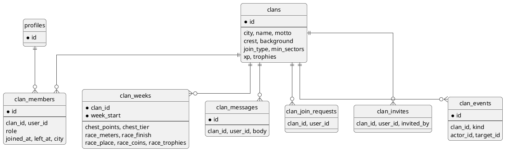

---
tags:
  - механика
  - кланы
  - схема
aliases:
  - "Клан"
source: "DOCS.md § «Кланы»"
updated: 2026-10-07
---
# Кланы

Клан привязан к городу. Создать — игрок с 3+ захваченными секторами, 700 монет. Вступить — в открытый сразу, в остальные по заявке или приглашению.

- Данные: `clans`, `clan_members` (с историей — `left_at`/`left_reason`), `clan_join_requests`, `clan_invites`, `clan_events` (журнал), `clan_weeks` (итоги недели: сундук, битва кланов, `race_void`).
- Экраны: `ClanListScreen` (поиск, приглашения, создание), `ClanScreen` (шапка `ClanHero`, вкладки «Участники / Сундук / Битва кланов», блок модерации для супер-админа), `ClanEditorScreen` (создание и настройки, 4 шага с живым превью), `ClanRaceScreen` (битва кланов целиком). Вход — карточка клана в профиле, пилюля в чужом профиле, строка клана на экране сектора, вкладка «Кланы» в рейтинге, ссылка `?clan=ID`.
- Герб — `ClanCrest` (форма + символ + два цвета, `lib/data/clanCrests.ts`), фон — `lib/data/clanBackgrounds.ts`, уровни/лиги/роли — `lib/data/clanLevels.ts`.
- Карта, верх — одна панель `.map-hud` на всю ширину (MapScreen): логотип и переключатель «Игроки | Кланы» в первой строке, под ними легенда в одну строку (мои / чужие / свободные, либо гербы топ-3 кланов с числом секторов и «Без клана»), а у игрока в клане — оранжевый низ панели «Битва кланов» (`MapRacePill`: место или % пути, время до итогов, полоска прогресса). Слой «Кланы»: сектора в цвет герба владельца, одиночки серые, на метках гербы; выбор слоя запоминается на устройстве.
- У игрока может быть клан в каждом городе; всё, что «мой клан», — это клан текущего города профиля. Действия в клане передают `clanId` явно.
- Гербы у имён: в недельном рейтинге (`useClanBadges` → `get_clan_badges`, запрос только когда открыт рейтинг) и на карточках секторов (`ownerClanCrest` из `territories_with_stats`).
- Хуки — в `lib/supabase/queries.ts` (`useClan`, `useClanList`, `useClanChest`, `useClanRace`, `useClanBadges`, `useAdminModerateClan` и т.д.); после изменения членства — `invalidateClanMembership()`.
- Общий сектор: улов соклановца на секторе клана (клан города сектора) добавляет его в `territory_shares` — до 4 держателей вместе с хозяином, пятый просто поддерживает. `territories_with_stats.co_holders` → `Territory.coHolders` (у каждого `isMe`). Хозяин (`owner_id`) остаётся хозяином для щита, битвы кланов и счётчика секторов в профиле. В рейтинге недели (и его итогах) и в достижениях доля считается целым сектором: `_weekly_sector_counts` на сервере, `heldTerritories()` в `lib/data/achievements.ts` на клиенте. Смена хозяина (чужой захват, модерация, перенос улова) обнуляет доли и шлёт бывшим совладельцам «сектор забрали» (триггер `territories_owner_changed`); выход из клана снимает доли ушедшего и доли на его секторах (`clan_members_left_shares`).
- «Захватил сектор» на общем секторе — держатель (хозяин или совладелец) с самым свежим уловом на этом секторе: `territories_with_stats.capturer_id` → `Territory.capturerId`, выбор — `lib/data/sectorHolders.ts`. Остальные держатели — в «Совладельцах». Хозяин в базе (`owner_id`) от этого не меняется.
- Рисунок общего сектора — `lib/map/sectorParts.ts` (`splitSector`): сота режется на 2 (верх/низ), 3 («Y») или 4 («+») равные части, часть 0 — хозяину. На карте части — отдельные неинтерактивные полигоны под контуром соты, линии разреза белые, аватарки в центрах частей, номер в центре соты; на слое «Кланы» — один герб. На экране сектора — то же на мини-карте (`TerritoryThumbnailMap`) и блок «Совладельцы»; своя часть — своим цветом, значок «Моя доля».

## См. также
- [[Чат клана]]
- [[Сундук недели и битва кланов]]
- [[Номер клана и церемония битвы]]
- [[Сектора, защита и щит]]
