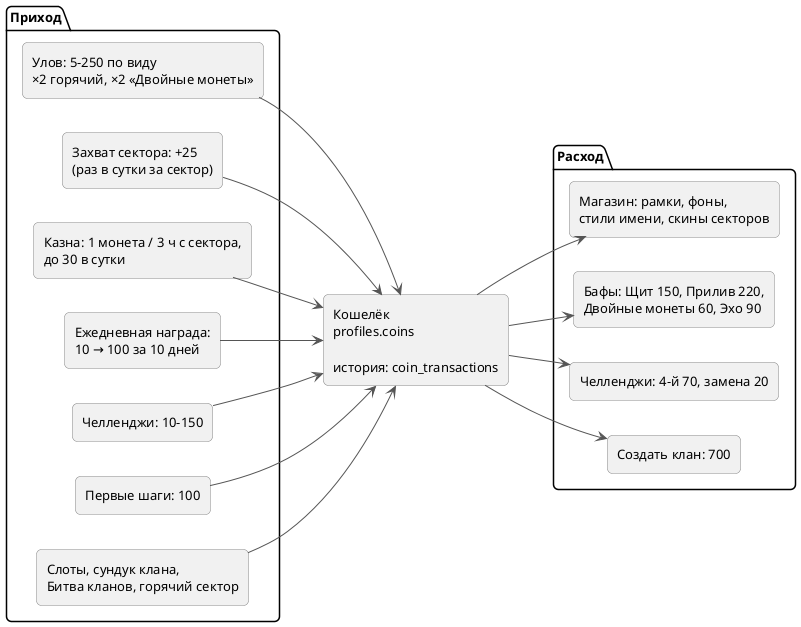

---
tags:
  - механика
  - схема
aliases:
  - "Монеты"
  - "Экономика"
  - "Магазин"
  - "Бафы"
  - "Казна"
updated: 2026-10-07
---
# Монеты и экономика

Баланс — `profiles.coins`, каждое движение — строка в `coin_transactions` (у монет за улов есть `catch_id`, чтобы модерация могла их вернуть). Числа сверены с базой и кодом; для игроков они в FAQ (`web/lib/data/faq.ts`, раздел «Монеты»), там же таблица цен по видам рыб (`species.coin_value`).

- Монеты за улов зависят только от вида: от 5 до 250. Горячий сектор ×2, «Двойные монеты» ×2 (вместе ×4).
- «Двойные монеты» удваивают уловы, захваты, челленджи, достижения и награды клана; Казну, ежедневную награду и слоты — нет.
- Слоты: 1 бесплатный прокрут в день и по одному за улов, до 4; джекпот 0,3% (рамка «Катран» / «Сом»).

## См. также
- [[Сектора, защита и щит]]
- [[Сундук недели и битва кланов]]
- [[Фиксация улова]]
