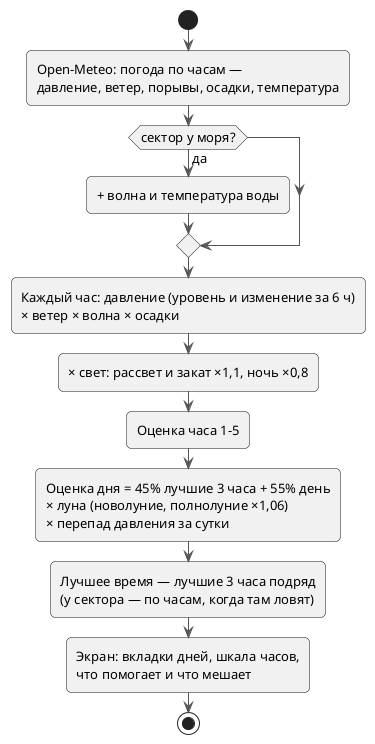

---
tags:
  - механика
  - схема
aliases:
  - "Прогноз"
  - "Клёв"
  - "Open-Meteo"
updated: 2026-10-07
---
# Прогноз клёва

Погода — Open-Meteo (бесплатно, без ключа, CC BY 4.0), оценка считается на телефоне: `web/lib/forecast/bite.ts`, хук `useBiteForecast`, экран — `BiteForecast.tsx`. Город (значок «Прогноз клёва» на карте) и сектор («Прогноз клёва здесь») используют одну модель; у сектора «лучшее время» выбирается по часам, когда там реально ловят (если уловов ≥ 10).

## Экран прогноза

- Вверху — вкладки дней (сегодня и ещё 3). Крупная цифра — **оценка на весь день**, рядом лучшее время и температура воздуха и воды.
- «По часам» — шкала, по которой ведут пальцем: под ней клёв и погода в выбранный час (воздух, ветер со стрелкой, давление, волна или осадки). Столбики окрашены оценкой часа, прошедшие часы бледнее, лучшее время отмечено скобкой. Пока палец на шкале, экран не прокручивается.
- «Что влияет на оценку» — давление, ветер, волна, осадки, луна, солнце; точка зелёная (помогает), серая (нейтрально) или красная (мешает) — из тех же кривых, что и оценка (`dayTones`).
- Раз в день в 19:00 бот может прислать «Завтра хороший клёв» (4–5, не чаще двух раз в неделю) — `/api/telegram/forecast-alert`.

## См. также
- [[API-маршруты]]
- [[Фоновые задачи (pg_cron)]]
