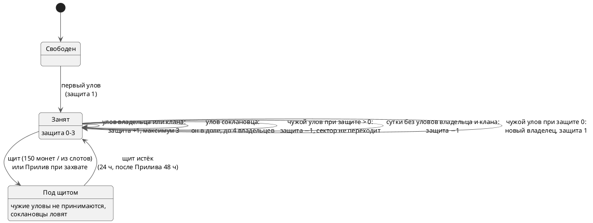

---
tags:
  - механика
  - схема
aliases:
  - "Сектор"
  - "Защита"
  - "Щит"
  - "Прилив"
  - "Горячие сектора"
updated: 2026-10-07
---
# Сектора, защита и щит

Вода Батуми и Москвы поделена на шестиугольные сектора (id `B0144`, `M3291`; сетка — [[Генератор сетки секторов]]). Правила для игроков — в FAQ (`web/lib/data/faq.ts`, раздел «Сектора»); здесь — как они устроены.

## Жизнь сектора

## Правила

- Свободный сектор становится твоим с первым уловом, защита — 1.
- **Защита 0–3** (`territories.defense`, `defense_at`): улов владельца или его клана +1 (максимум 3); чужой улов −1, сектор не переходит; без уловов владельца и клана защита тает на 1 в сутки. При защите 0 следующий чужой улов забирает сектор.
- **Клан:** соклановцы не отнимают сектора друг у друга — улов добавляет соклановца в долю (`territory_shares`), до 4 владельцев; в рейтинге, профиле и достижениях это целый сектор каждому.
- **Щит** (`territories.shield_until`): 24 часа чужие не могут отметить улов, соклановцы могут. 150 монет или бесплатно из слотов (`profiles.free_shields`).
- **Прилив** (220 монет): следующий захваченный сектор получает щит на 48 часов.
- **Горячие сектора** (`hot_sectors`): каждую пятницу в 12:00 — самый популярный сектор за 30 дней и соседний; до конца воскресенья улов ×2 монеты, Казна ×3; держатель в конце недели получает 100 монет и медаль. Один сектор не бывает горячим две недели подряд.
- **Легенда сектора** (`sector_legends`): больше всех уловов за 90 дней, минимум 10.

Вся логика захвата — в `confirm_catch` ([[Фиксация улова]]); расписание горячих — [[Фоновые задачи (pg_cron)]].

## См. также
- [[Монеты и экономика]]
- [[Кланы]]
- [[Координаты сектора]]
