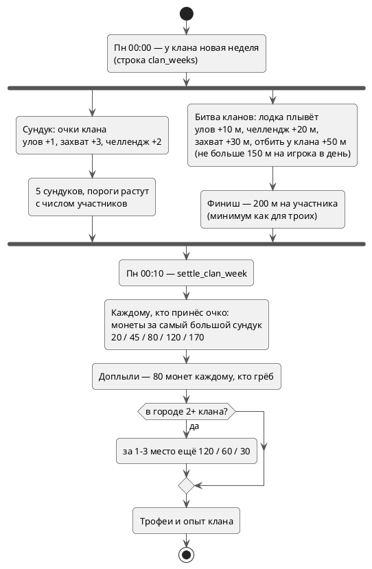

---
tags:
  - механика
  - кланы
  - схема
aliases:
  - "Сундук"
  - "Битва кланов"
  - "Регата"
source: "DOCS.md § «Сундук недели и битва кланов»"
updated: 2026-10-10
---
# Сундук недели и битва кланов

- Очки и метры считаются из событий недели (`_clan_week_events`): улов +1 очко / +10 м, захват +3 / +30 (у игрока другого клана +50 м), недельный челлендж +2 / +20.
- Битва кланов: потолок 150 м на игрока в сутки, финиш 200 м × участников (минимум 3).
- `get_clan_chest(clan_id)`, `get_clan_race(city)` (таблица гонки, «сегодня ты принёс», гребцы своего клана, подиум прошлой недели).
- Личный вклад: во вкладке «Сундук» экрана клана — очки каждого, во вкладке «Битва кланов» — метры каждого за неделю (`my_rowers`, с потолком 150 м в день; только для своего клана — у чужого блока нет), на экране битвы — «Гребцы клана за неделю».
- Кроны: `clan-race-tick` раз в 10 минут (уведомления «вас обогнали», не чаще раза в 3 часа, и «доплыли»); `settle_clan_week` в понедельник 00:10 по времени города (монеты, трофеи, опыт, уведомления `clan_chest_reward` / `clan_race_result`, ссылка `?race=1` открывает битву кланов).

## См. также
- [[Кланы]]
- [[Фоновые задачи (pg_cron)]]
- [[Монеты и экономика]]
