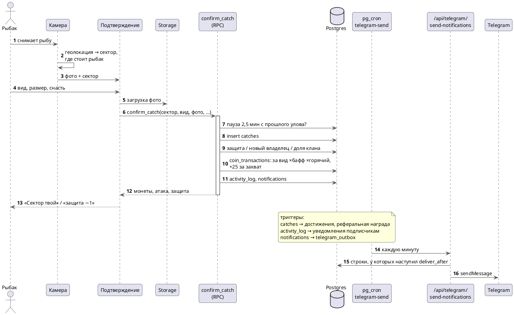

---
tags:
  - механика
  - схема
aliases:
  - "Улов"
  - "confirm_catch"
  - "Камера"
source: "DOCS.md § «Геолокация и быстрая фиксация улова»"
updated: 2026-10-07
---
# Фиксация улова

Улов засчитывается в сектор, где стоит рыбак; между уловами — пауза 2,5 минуты (`COOLDOWN` в `confirm_catch`). Без сети улов ждёт на телефоне до суток и уходит по времени снимка. Всё, что меняется в базе, делает одна RPC `confirm_catch` — монеты, защита, доля клана, уведомления.

Связанные заметки: [[База данных]] · [[Фоновые задачи (pg_cron)]] · [[Уведомления в Telegram]]

`lib/geolocation.ts` — две отдельные функции: `getCurrentCoords()` оборачивает `navigator.geolocation.getCurrentPosition` в промис и возвращает `{lat, lng} | null` (при отказе/таймауте/отсутствии API — `null`, никогда не бросает исключение); `nearestTerritory(lat, lng, territories)` — чистая функция, считает ближайшую территорию (haversine) и возвращает её, только если расстояние ≤ 400 м от центра соты, иначе `null`. Разделены намеренно — координаты нужны и для маркера на карте (показывается независимо от того, попал ли пользователь на сектор), и для поиска сектора отдельно.

**«+» — единственный путь к камере.** Выбор сектора вручную (клик по полигону на карте, карточка в карусели, список территорий, «Мои территории» в профиле) открывает только `TerritoryScreen` — экран статистики/уловов, без кнопки, ведущей к камере (см. [[Указатель решений|DECISIONS.md]], «вручную — только просмотр»). Запрашивается геолокация **только по нажатию «+»**, не автоматически при заходе на карту — карта публична (см. решение выше), не хотим просить геолокацию у анонимных посетителей, которые просто смотрят карту.

`FishZoneApp.handlePlus()`: не залогинен → вкладка «Профиль»; залогинен → тост «Определяем твоё местоположение…», `await getCurrentCoords()`. Геолокация не удалась технически (отказ/таймаут/нет API) → тост с ошибкой, ничего больше. Координаты получены → **маркер на карте ставится в любом случае** (`mapHandleRef.current?.showUserLocation(lat, lng)`, синяя точка с пульсацией, `LeafletMapHandle.showUserLocation`) — затем ищем сектор (`nearestTerritory`): нашли → карта долетает до него (`flyToTerritory`) и сразу открывается камера; не нашли (человек не на воде — например, в центре города) → модальное окно «Ты не на территории» (`.modal-overlay`/`.modal-card` в `globals.css`, новый переиспользуемый паттерн; сверху — `.modal-icon`, круглый градиент с SVG «геометка перечёркнута»), сообщающее коротким текстом, что зафиксировать улов не получится, без каких-либо вариантов обойти это вручную.

После геолокации/выбора территории открывается `CameraScreen.tsx` — **настоящий доступ к камере** (`getUserMedia`, не имитация, см. [[Указатель решений|DECISIONS.md]]), без экрана-обхода:
- `intro` — объяснение «Быстрое добавление» + кнопка «Разрешить доступ к камере».
- клик → `requesting` → `getUserMedia({video:{facingMode:'environment'}, audio:false})`. Успех → `live`: `<video>` с потоком, `srcObject` подключается через `useEffect` по смене состояния (не сразу в обработчике клика — в момент, когда промис резолвится, элемент `<video>` ещё не смонтирован, т.к. рендерится только при `state==='live'`).
- затвор → кадр рисуется в offscreen `<canvas>` (даунскейл до 1280px по ширине), поток немедленно останавливается (`track.stop()`), `canvas.toBlob('image/jpeg', 0.85)` → `onCapture(blob)`.
- отказ/ошибка → `denied` — сообщение «Без доступа к камере нельзя сфотографировать улов и занять территорию» + кнопка **«Запросить доступ снова»** (тот же обработчик, что у intro). Нет пути пропустить фото — только повтор или × (назад на карту).
- `FishZoneApp` передаёт `CameraScreen` с `key={cameraSessionId}` (счётчик, инкрементируется при каждом новом заходе в камеру) — экран камеры никогда не размонтируется сам по себе (все экраны держатся в DOM, переключается только CSS `.active`), поэтому без явного `key` state оставался бы `live` со уже остановленным потоком при следующей попытке снять улов (застывший кадр). `key` форсирует полный ремаунт → чистое состояние `intro` на каждый новый заход.

Кадр сразу передаётся в `FishZoneApp.handleCapture(blob)`, который переключает на `screen-confirm` и **в фоне запускает загрузку** (`uploadCatchPhoto`, `lib/supabase/storage.ts`) — не дожидаясь заполнения формы. `ConfirmScreen.tsx` показывает **фото и форму на одном экране** одновременно: превью через `URL.createObjectURL(capturedPhoto)`, переключатель категории «Морская/Пресноводная» (по умолчанию — от `territory.kind`), `<select>` вида рыбы (обязателен, список — из `useSpecies()`, отфильтрован по категории), необязательные размер/вес/способ ловли/приманка. Поверх фото — статус загрузки: спиннер, пока `photoStatus==='uploading'`; при `'error'` — сообщение «Не удалось загрузить фото. Без фото улов сохранить нельзя.» + кнопка **«Повторить попытку»** (грузит тот же `Blob` заново, без возврата к камере). Кнопка «Подтвердить улов» задизейблена, пока не выбран вид рыбы **и** `photoStatus !== 'success'` — без успешно загруженного фото улов физически нельзя отправить (см. [[Указатель решений|DECISIONS.md]]).

## См. также
- [[Сектора, защита и щит]]
- [[Монеты и экономика]]
- [[Уведомления в Telegram]]
