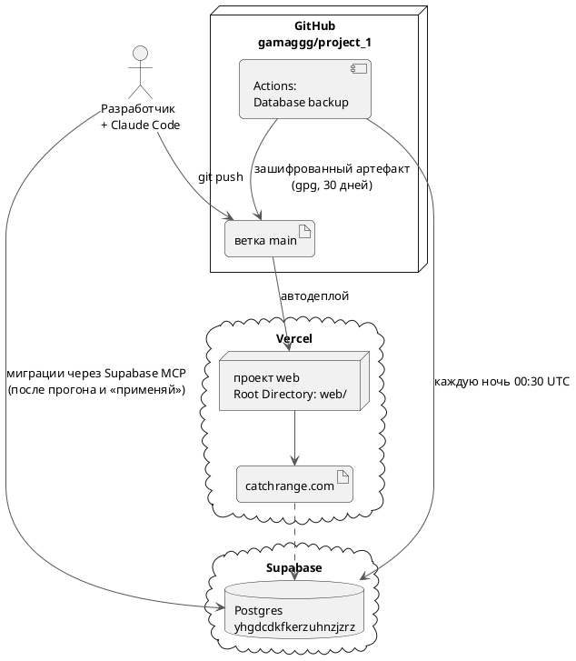

---
tags:
  - эксплуатация
  - схема
aliases:
  - "Vercel"
  - "Продакшен"
source: "DOCS.md § «Деплой»"
updated: 2026-10-07
---
# Деплой

Основной домен — **catchrange.com**; какая версия выкачена — `https://catchrange.com/api/version` (хеш коммита). Пуш в `main` → Vercel собирает `web/` автоматически.

## Исходное описание

Продакшен: **https://web-flame-mu-44.vercel.app** (Vercel-проект `web`, команда `gamag`, привязан к `gamaggg/project_1`, ветка `main`, Root Directory `web`). Автодеплой при пуше в `main`.

## См. также
- [[Резервные копии базы]]
- [[Локальная разработка]]
- [[Миграции базы — правила]]
