---
tags:
  - механика
aliases: []
updated: {{date}}
---
# {{title}}

Одна-две фразы: что это для игрока.

```plantuml-svg
@startuml
skinparam shadowing false
skinparam defaultFontName Helvetica
start
:шаг;
stop
@enduml
```

## Правила
- Числа — из базы и кода, совпадают с FAQ (`web/lib/data/faq.ts`).

## Как устроено
Таблицы, RPC, задачи `pg_cron`.

## См. также
- [[Монеты и экономика]]
